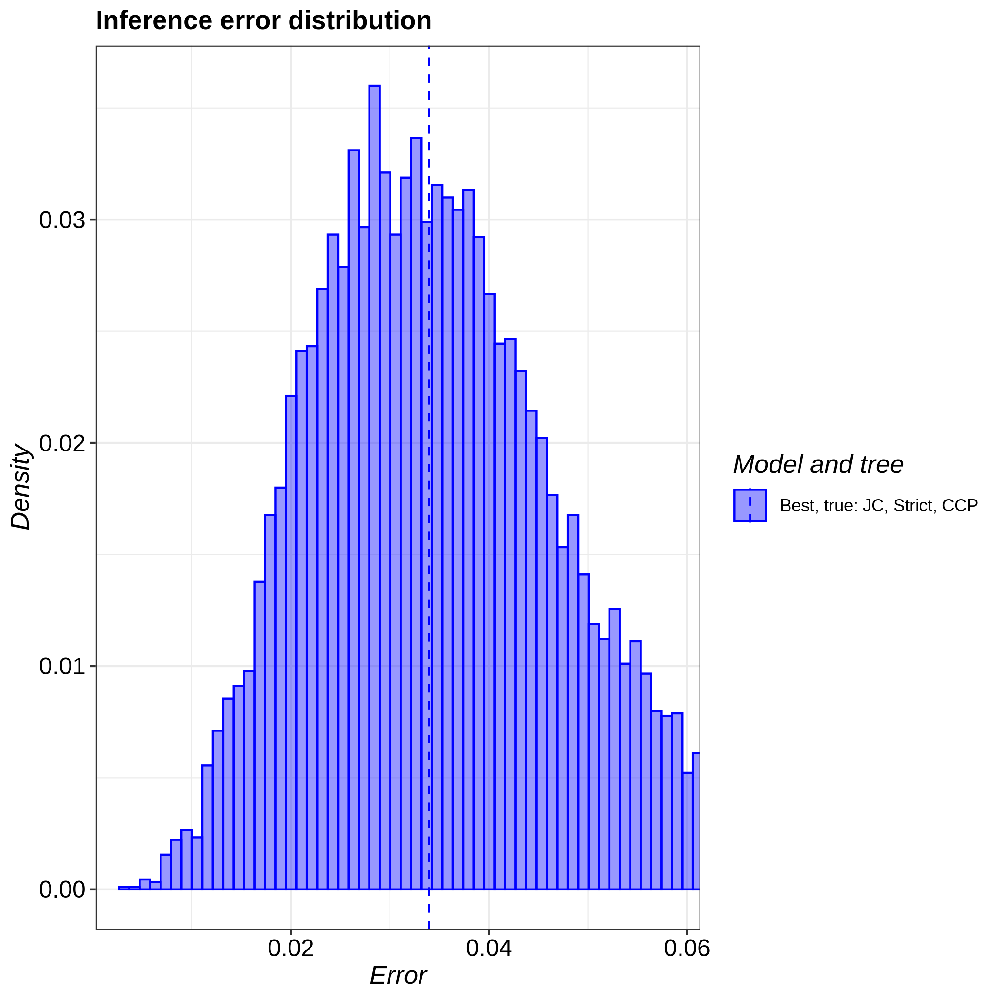

# pirouette_example_12

Branch   |                                                                                                 |                                                                                               
---------|--------------------------------------------------------------------------------------------------------------------------------------------------------------|---------------------------------------------------------------------------------------------------------------------------------------------------------------------------------------------
`master` | |
`develop`||

A [pirouette example](https://github.com/richelbilderbeek/pirouette_examples).

## Results

